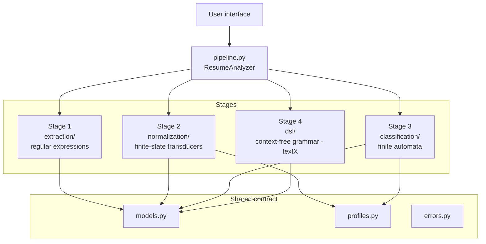
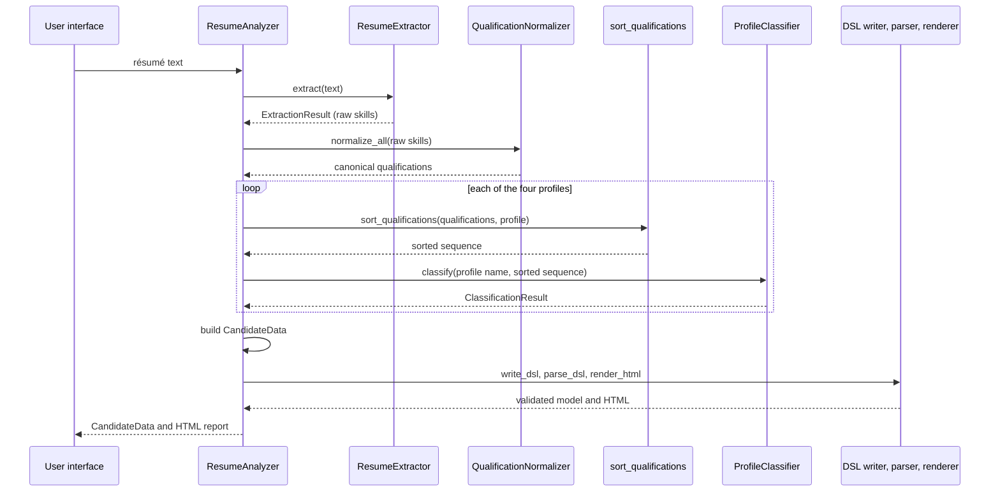

# Architecture

This document describes how ResumeLens is organized: its components, how data flows between them, and the design decisions behind the structure. The detailed designs of each stage are in the other documents of this directory.

| Topic | Document |
|---|---|
| Stages 1 and 2: modules, formal definitions, tests | [modules_extraction_normalization.md](modules_extraction_normalization.md), [formalization_extraction_normalization.md](formalization_extraction_normalization.md), [tests_extraction_normalization.md](tests_extraction_normalization.md) |
| Stages 3 and 4: modules, formal definitions, tests | [modules_classification_dsl.md](modules_classification_dsl.md), [formalization_classification_dsl.md](formalization_classification_dsl.md), [tests_classification_dsl.md](tests_classification_dsl.md) |
| Background and references | [literature_review.md](literature_review.md) |

## 1. Design principles

1. **One general solution for every profile.** The four professional profiles (Full Stack Developer, Machine Learning Engineer, DevOps Engineer and Data Engineer) are processed by the same code. A profile is only data: an ordered list of categories, and each category is an ordered list of accepted qualifications. There is no profile-specific branching in the code.
2. **One formal model per stage.** Each stage is built on the formal language model that fits its task: regular expressions, finite-state transducers, finite automata and a context-free grammar.
3. **Stages communicate through plain data.** Each stage receives and returns simple data structures defined in one place (`models.py`). A stage does not know how the previous or the next one is implemented.
4. **The engine does not depend on the interface.** The core is a set of functions and classes that take text and return data. The user interface only calls the pipeline.
5. **Evaluate, do not decide.** The system reports whether the qualifications explicitly written in a résumé satisfy the pattern of a profile. It does not rank candidates or make hiring decisions.

## 2. Component view



## 3. Project structure

```
ResumeLens/
|-- README.md
|-- requirements.txt
|-- pytest.ini
|-- data/
|   |-- resumes/                 sample resumes used by tests
|   `-- profiles_dsl/            sample candidate-profile files (valid and invalid)
|-- docs/                        design documents (Markdown)
|-- src/resumelens/
|   |-- models.py                data structures shared by all stages
|   |-- profiles.py              the four profiles, defined as data
|   |-- errors.py                project exceptions
|   |-- pipeline.py              ResumeAnalyzer: runs the four stages in order
|   |-- extraction/              Stage 1: patterns.py, regex_extractor.py
|   |-- normalization/           Stage 2: variants.py, transducer_builder.py,
|   |                            normalizer.py, qualification_sorter.py
|   |-- classification/          Stage 3: profile_automata.py, profile_classifier.py
|   |-- dsl/                     Stage 4: candidate_profile.tx, dsl_writer.py,
|   |                            dsl_parser.py, html_renderer.py
|   `-- ui/                      user interface
`-- tests/                       one folder per stage, plus pipeline tests
```

## 4. Components

| Component | Formal model | Input | Output | Responsibility |
|---|---|---|---|---|
| `ResumeExtractor` | Regular expressions (`re`) | Résumé text | `ExtractionResult` | Finds contact data, experience, education and the raw skill strings |
| `QualificationNormalizer` | Finite-state transducers (`pyformlang`) | Raw skill strings | Canonical qualifications | Rewrites equivalent spellings into one canonical name |
| `sort_qualifications` | Ordering by profile categories | Canonical qualifications and a `Profile` | Sorted sequence | Removes the dependence on the order written by the candidate |
| `ProfileClassifier` | Deterministic finite automata (`pyformlang`) | Profile name and sorted sequence | `ClassificationResult` | Decides whether the sequence satisfies the profile pattern |
| `write_dsl` | Context-free grammar | `CandidateData` | DSL text | Writes the structured candidate profile |
| `parse_dsl` | Context-free grammar (`textX`) | DSL text | Validated model | Validates the text and rejects lexical or syntactic errors |
| `render_html` | None (presentation) | Validated model | HTML | Generates the visualization of the candidate |
| `ResumeAnalyzer` | None (orchestration) | Résumé text | `CandidateData` and the HTML report | Connects the stages in order |

## 5. Data flow



The data that travels between the stages:

| Data | Defined in | Produced by | Consumed by |
|---|---|---|---|
| `ExtractionResult` | `models.py` | Stage 1 | Pipeline |
| Canonical qualifications (`list[str]`, for example `NODE_JS`) | Catalog in `variants.py` | Stage 2 | Sorter |
| Sorted sequence (`list[str]`) | `profiles.py` categories | Sorter | Stage 3 |
| `ClassificationResult` | `models.py` | Stage 3 | Pipeline |
| `CandidateData` | `models.py` | Pipeline | Stage 4 |
| DSL text and validated model | `candidate_profile.tx` | Stage 4 writer and parser | Renderer |

## 6. Profiles as data

`profiles.py` defines each profile as a `Profile` with an ordered tuple of `ProfileCategory`. For example, the categories of `FULL_STACK_DEVELOPER` are `LANGUAGE`, `FRONTEND`, `BACKEND`, `DATABASE` and `VERSION_CONTROL`, and `FRONTEND` accepts `REACT`, `ANGULAR` or `VUE`.

The same description feeds three components:

- the **sorter** uses the category order and the priority inside each category;
- the **automaton builder** creates the states `q0 ... qN` (one step per category) and one transition for each accepted qualification;
- the **catalog check** in the tests verifies that every qualification of every profile has spellings in the transducer catalog.

Adding a profile means adding one `Profile` entry and the spellings of its new qualifications. No stage has to change.

## 7. Stage 3 and Stage 4 in the architecture

**Classification.** `build_profile_automaton(profile)` creates a DFA with `len(categories) + 1` states, where state `q(i)` goes to `q(i+1)` on every qualification of category `i`, and the last state is the only accepting state. `ProfileClassifier` builds one automaton per profile once and reuses it for every résumé.

**Candidate profile language.** The writer converts `CandidateData` to a text in the DSL, the parser validates that text with the textX grammar `candidate_profile.tx` and raises `InvalidProfileError` when it breaks the lexical or syntactic rules, and the renderer turns the validated model into an HTML page. The pipeline always writes and then parses the profile, so the HTML is only generated from a text that has been validated.

## 8. Errors

| Exception | When it is raised |
|---|---|
| `UnknownProfileError` | A profile name is not one of the four supported profiles |
| `InvalidProfileError` | A DSL text violates the grammar |

Stage 1 never raises exceptions for unrecognizable text: it returns an empty `ExtractionResult`, and the later stages report that no profile is accepted.

## 9. Design decisions

| Decision | Reason | Trade-off |
|---|---|---|
| Profiles as data | One engine for four profiles, as the assignment requires, and new profiles without code changes | A profile is limited to "one qualification per category, in order" |
| Sort before classifying | The result does not depend on the order of the résumé, and the automata stay simple | Qualifications outside the profile categories are ignored |
| One transducer per canonical qualification, one path per spelling | Each transducer is small, can be formalized as a 7-tuple and can be tested alone | Many transducers; all of them are built from one function |
| DFA for every profile | At most one transition per state and symbol, easy to explain and to test | Optional qualifications cannot be expressed without a more general automaton |
| Writing and parsing the DSL inside the pipeline | The HTML is always generated from validated data | A small extra cost for each résumé |
| Plain dataclasses for the shared data | Clear contracts between stages without extra dependencies | No automatic validation of field values |
| Stage 1 returns raw strings | Extraction does not decide equivalence; that belongs to Stage 2 | The catalog of spellings must cover what the patterns find |

## 10. Testing strategy

- **Unit tests per stage** in `tests/extraction`, `tests/normalization`, `tests/classification` and `tests/dsl`. Each stage is tested without the others; the tests of Stages 3 and 4 build their input data directly.
- **Sample résumés** in `data/resumes` for each profile, a résumé accepted by two profiles and a résumé accepted by none.
- **Pipeline tests** in `tests/test_pipeline.py` that run complete résumés from text to HTML.
- Run everything with `python -m pytest`.

## 11. Known limitations

- The extractor recognizes the spelling of a skill, not its meaning.
- The accepted résumé format uses explicit labels for location, current role and summary.
- Qualifications are matched against a fixed catalog of spellings.
- A profile is a single ordered pattern; alternative orders or optional categories would need a more general automaton.
