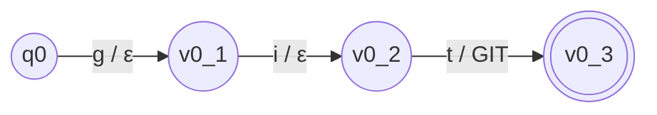
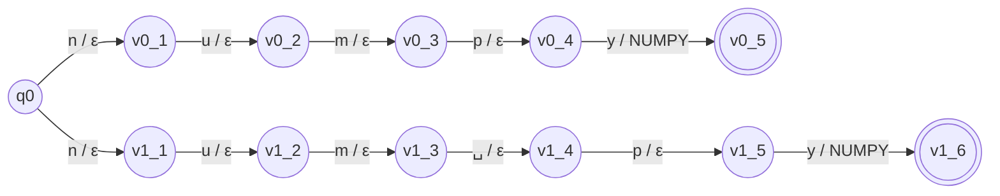
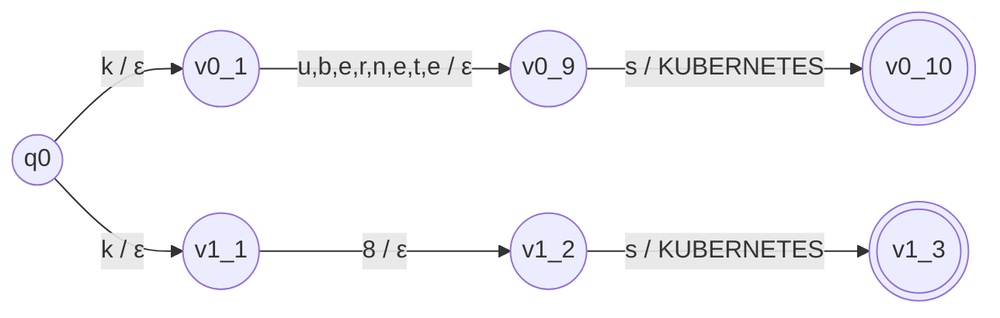

# Formalization: Extraction and Normalization (Stages 1 and 2)

This document gives the formal models behind the first two stages of ResumeLens: the **regular expressions** of Stage 1 and the **finite-state transducers** of Stage 2.

---

# Part 1. Stage 1: Regular expressions

## 1.1 Role of the regular expressions

Each type of information in a resume is described by a regular expression `R` over the alphabet of text characters. The expression defines a language `L(R)`, the set of strings that it recognizes. The extractor scans the text and returns the substrings that belong to `L(R)`. Stage 1 does **not** decide whether two strings are equivalent, and it does not decide whether a candidate satisfies a profile.

The expressions are implemented with Python's `re` module in `src/resumelens/extraction/patterns.py`.

Notes on the notation used by `re`:

- `(?i)` makes the expression case-insensitive, `(?m)` makes `^` and `$` match at every line, and `(?s)` makes `.` match line breaks.
- `[ \t]` is a space or a tab, and `\w` is a letter, digit or underscore.
- `(?<!X)` and `(?!X)` are *look-behind* and *look-ahead* assertions. They do not consume characters and only check the context of a match. They are an extension of `re` and are not part of the formal regular operators (union, concatenation and Kleene star). They are used only to avoid matches inside longer words. Without them, every expression below is a classical regular expression.

## 1.2 Contact and personal data

### Name: `NAME_PATTERN`

```
[A-ZÁÉÍÓÚÑ][\w'’-]*(?:\s+(?:(?:de|del|la|las|los|y)\s+)*[A-ZÁÉÍÓÚÑ][\w'’-]*){1,4}
```

**Language recognized:** a word that starts with a capital letter, followed by one to four more capitalized words. Between words, the lowercase connectors `de`, `del`, `la`, `las`, `los` and `y` may appear (`Juan de la Cruz`). Words may contain letters, digits, apostrophes and hyphens. It is applied with `fullmatch` only to the first non-empty line of the resume.

Examples that match: `Wednesday Addams`, `Mary Jane Watson`, `Juan de la Cruz`. Examples that do not match: `Technical Skills:` (colon), `resume` (one lowercase word).

### E-mail: `EMAIL_PATTERN`

```
[\w.+-]+@[\w-]+(?:\.[\w-]+)+
```

**Language recognized:** a local part of one or more letters, digits, `_`, `.`, `+` or `-`, the symbol `@`, a domain label, and one or more additional labels preceded by a dot. Example: `wednesday.addams@example.com`.

### Phone: `PHONE_PATTERN`

```
(?<!\d)(?:\+\d{1,3}[\s.-]?)?\(?\d{3}\)?[\s.-]?\d{3}[\s.-]?\d{4}(?!\d)
```

**Language recognized:** an optional country code (`+` and one to three digits), a group of three digits that may be inside parentheses, a group of three digits, and a group of four digits, with an optional space, dot or hyphen between groups. The number cannot be preceded or followed by another digit. Examples: `+57 300 123 4567`, `310 555 1234`, `(300) 123-4567`. A date such as `2020-2024` does not match.

### Links: `LINK_PATTERN`

```
(?i)(?:https?://|www\.)[^\s,;<>()\"']+|(?:linkedin\.com|github\.com)/[^\s,;<>()\"']+
```

**Language recognized:** the union of two forms. First, `http://`, `https://` or `www.` followed by one or more characters that are not spaces, commas, semicolons, angle brackets, parentheses or quotes. Second, a bare `linkedin.com/` or `github.com/` path. Trailing punctuation is removed by the extractor. Example: `https://github.com/wednesday-addams`.

### Location: `LOCATION_PATTERN`

```
(?im)^[ \t]*location[ \t]*:[ \t]*(.+?)[ \t]*$
```

**Language recognized:** a line that begins with the label `Location`, a colon and the value, which is captured. Example: `Location: Nevermore Academy, Jericho`.

### Current role: `CURRENT_ROLE_PATTERN`

```
(?im)^[ \t]*(?:current[ \t]+role|role)[ \t]*:[ \t]*(.+?)[ \t]*$
```

**Language recognized:** a line that begins with `Current role` or `Role`, a colon and the value, which is captured.

### Summary: `SUMMARY_PATTERN`

```
(?ims)^[ \t]*(?:profile[ \t]+summary|summary|profile)[ \t]*:[ \t]*\n?(.+?)(?:\n[ \t]*\n|\Z)
```

**Language recognized:** a label (`Profile Summary`, `Summary` or `Profile`) and a colon, followed by text that extends up to the first blank line or the end of the resume. The captured text is the summary.

## 1.3 Education and experience

### Education: `EDUCATION_PATTERN`

```
(?im)^[ \t]*(?:[-*•][ \t]*)?((?:bachelor|master|ph\.?d|doctorate|associate|diploma|b\.?sc|m\.?sc|ingenier[ií]a|licenciatura)[^\n]*?)[ \t]*$
```

**Language recognized:** a line that, after an optional bullet, starts with a degree word (`bachelor`, `master`, `phd`, `doctorate`, `associate`, `diploma`, `bsc`, `msc`, `ingeniería`, `licenciatura`) followed by any text up to the end of the line. The whole line is captured. Example: `Bachelor in Computer Science - Nevermore Academy`.

### Experience header: `EXPERIENCE_HEADER_PATTERN`

```
(?i)[ \t]*(?P<role>[^\n(]+?)[ \t]+(?:[-–—@]|at)[ \t]+(?P<organization>[^\n(]+?)[ \t]*\([ \t]*(?P<years>\d+)[ \t]+years?[ \t]*\)[ \t]*$
```

**Language recognized:** a line with the shape `role SEPARATOR organization (N years)`, where the separator is `-`, `–`, `—`, `@` or the word `at`, and `N` is a sequence of digits followed by `year` or `years` inside parentheses. The three named groups are captured. Example: `Web Application Developer - Nevermore Academy Projects (3 years)`.

### Experience sentence: `EXPERIENCE_SENTENCE_PATTERN`

```
(?i)(?P<years>\d+)[ \t]+years?[ \t]+of[ \t]+experience[ \t]*(?P<description>[^.\n]*)
```

**Language recognized:** a number, the word `year` or `years`, the words `of experience`, and the text that follows up to a period or the end of the line. Example: `3 years of experience developing web applications.`

### Highlights: `HIGHLIGHT_PATTERN`

```
[ \t]*[-*•][ \t]+(.+?)[ \t]*$
```

**Language recognized:** a line that begins with the bullet `-`, `*` or `•` followed by at least one space and the text of the highlight.

## 1.4 Skills

All four skill expressions share the same boundary fragments:

```
SKILL_START = (?<![\w.])      the match cannot be preceded by a letter, digit, underscore or dot
SKILL_END   = (?![\w+#])      the match cannot be followed by a letter, digit, underscore, + or #
```

Therefore `SQL` is not found inside `PostgreSQL` or `NoSQL`, and `js` is not found inside `React.js`. Each expression is `(?i) SKILL_START (alternation of spellings) SKILL_END`. The extractor returns the text exactly as written in the resume.

| Constant | Alternation of spellings (case-insensitive) |
|---|---|
| `LANGUAGE_PATTERN` | `java script`, `javascript`, `js`, `type script`, `typescript`, `ts`, `python`, `scala`, `java` |
| `FRAMEWORK_PATTERN` | `react`, `angular`, `vue`, `node` (each with optional `js`, `.js` or ` js`), `expressjs`, `express.js`, `django`, `spring boot`, `springboot`, `pandas`, `numpy`, `scikit-learn` (separator `-`, `_`, space or none), `sklearn`, `tensorflow`, `tensor flow`, `pytorch`, `py torch`, `spark`, `apache spark`, `pyspark`, `hadoop`, `airflow`, `dagster`, `prefect` |
| `DATABASE_PATTERN` | `postgres`, `postgresql`, `postgre sql`, `mysql`, `my sql`, `mongodb`, `mongo db`, `mongo`, `sql`, `snowflake`, `bigquery`, `big query`, `redshift` |
| `TOOL_PATTERN` | `github actions`, `gitlab ci` (optionally `/cd`), `git`, `docker`, `kubernetes`, `k8s`, `podman`, `jenkins`, `aws`, `amazon web services`, `azure`, `gcp`, `google cloud` (optionally `platform`), `terraform`, `ansible`, `linux` |

Example with the assignment fragment `JS, React.js, NodeJS, Postgres, Git.`: `LANGUAGE_PATTERN` finds `JS`; `FRAMEWORK_PATTERN` finds `React.js` and `NodeJS`; `DATABASE_PATTERN` finds `Postgres`; `TOOL_PATTERN` finds `Git`. These strings are the input of Stage 2.

## 1.5 Limitations of the extraction language

- The expressions recognize the **spelling**, not the **meaning**. A word such as `react` can match in free text that is not about the library.
- The labeled fields need their label (`Location:`, `Current role:`, `Summary:`).
- Years of experience are recognized only as digits.

---

# Part 2. Stage 2: Finite-state transducers

## 2.1 Definition

Every normalization transducer is a finite-state transducer

**M = (Q, Σ, Γ, δ, ω, q0, F)**

where:

- **Q** is a finite set of states.
- **Σ** is the input alphabet (the characters of the spellings that must be recognized).
- **Γ** is the output alphabet (the canonical name of the qualification; one symbol per transducer).
- **δ : Q × Σ → P(Q)** is the transition relation. It is nondeterministic: from one state and one input character there may be several next states.
- **ω : Q × Σ × Q → Γ\*** is the output relation. It assigns to each transition the (possibly empty) word that the transducer writes when it takes that transition.
- **q0 ∈ Q** is the initial state.
- **F ⊆ Q** is the set of accepting states.

A transducer *translates* a word `w = a1 a2 ... an` to the word `ω(p0,a1,p1) ω(p1,a2,p2) ... ω(p(n-1),an,pn)` when there is a path `q0 = p0, p1, ..., pn` with `p(i) ∈ δ(p(i-1), ai)` and `pn ∈ F`. If no path ends in an accepting state, the word has no translation.

## 2.2 General construction used by ResumeLens

For a canonical qualification `C` with the list of spellings `V = {v1, ..., vk}` (each `vi = ci1 ci2 ... ci(mi)`), the function `build_transducer(C, V)` builds the transducer:

- **Q** = { q0 } ∪ { s(i,j) : 1 ≤ i ≤ k, 1 ≤ j ≤ mi }  (the code names `s(i,j)` as `v{i-1}_{j}`).
- **Σ** = the set of characters that appear in the spellings of V.
- **Γ** = { C }.
- **δ(q0, ci1)** contains `s(i,1)`, and **δ(s(i,j-1), cij)** contains `s(i,j)` for `2 ≤ j ≤ mi`. There is one independent path per spelling, so the states are not shared between spellings.
- **ω(s(i,j-1), cij, s(i,j))** = ε (the empty word) when `j < mi`, and **ω(s(i,mi-1), cimi, s(i,mi))** = `C` for the last character of the spelling (for `mi = 1` the transition leaves `q0`).
- **q0** is the initial state.
- **F** = { s(i,mi) : 1 ≤ i ≤ k }, one accepting state per spelling.

Properties:

- The transducer is **nondeterministic**: several transitions leave `q0` on the same character when two spellings begin with the same character.
- The output is written **only on the last transition** of a path. If one spelling is a prefix of another (`react` and `reactjs`), the prefix path ends in an accepting state before the end of the longer word, so that path does not accept `reactjs`. Only the path of the longer spelling accepts it, and `REACT` is written exactly once.
- The translation is **functional**: every accepted word is translated to the same word `C`. The transducer is therefore a partial function `T_C : Σ* → {C}` with domain `V`.
- `|Q| = 1 + Σ mi`, `|F| = k` and `|δ| = Σ mi` (one transition per character of every spelling).

Before translating, the normalizer lowercases the raw text and collapses repeated spaces. The transducers are tried one by one and the first translation found is returned. Because no spelling belongs to two qualifications, at most one transducer translates a word.

## 2.3 Explicit formal definitions

### Transducer `GIT`  (spellings: `git`)

- **Q** = { q0, v0_1, v0_2, v0_3 }
- **Σ** = { g, i, t }
- **Γ** = { GIT }
- **δ**: δ(q0, g) = { v0_1 }, δ(v0_1, i) = { v0_2 }, δ(v0_2, t) = { v0_3 }
- **ω**: ω(q0, g, v0_1) = ε, ω(v0_1, i, v0_2) = ε, ω(v0_2, t, v0_3) = GIT
- **q0** = q0
- **F** = { v0_3 }



Translation: `git` → `GIT`. The words `gi` and `github` have no translation.

### Transducer `NUMPY`  (spellings: `numpy`, `num py`)

- **Q** = { q0, v0_1, v0_2, v0_3, v0_4, v0_5, v1_1, v1_2, v1_3, v1_4, v1_5, v1_6 }
- **Σ** = { n, u, m, p, y, ␣ }  (␣ is the space character)
- **Γ** = { NUMPY }
- **δ**:
  - δ(q0, n) = { v0_1, v1_1 }
  - δ(v0_1, u) = { v0_2 }, δ(v0_2, m) = { v0_3 }, δ(v0_3, p) = { v0_4 }, δ(v0_4, y) = { v0_5 }
  - δ(v1_1, u) = { v1_2 }, δ(v1_2, m) = { v1_3 }, δ(v1_3, ␣) = { v1_4 }, δ(v1_4, p) = { v1_5 }, δ(v1_5, y) = { v1_6 }
- **ω**: ω(v0_4, y, v0_5) = NUMPY and ω(v1_5, y, v1_6) = NUMPY. Every other transition outputs ε.
- **q0** = q0
- **F** = { v0_5, v1_6 }



Translations: `numpy` → `NUMPY` and `num py` → `NUMPY`.

### Transducer `KUBERNETES`  (spellings: `kubernetes`, `k8s`)

- **Q** = { q0, v0_1, ..., v0_10, v1_1, v1_2, v1_3 }  (14 states)
- **Σ** = { k, u, b, e, r, n, t, s, 8 }
- **Γ** = { KUBERNETES }
- **δ**: the path `q0 -k→ v0_1 -u→ v0_2 -b→ v0_3 -e→ v0_4 -r→ v0_5 -n→ v0_6 -e→ v0_7 -t→ v0_8 -e→ v0_9 -s→ v0_10` and the path `q0 -k→ v1_1 -8→ v1_2 -s→ v1_3`. δ(q0, k) = { v0_1, v1_1 }.
- **ω**: ω(v0_9, s, v0_10) = KUBERNETES and ω(v1_2, s, v1_3) = KUBERNETES. Every other transition outputs ε.
- **q0** = q0
- **F** = { v0_10, v1_3 }



The edge `u,b,e,r,n,e,t,e` abbreviates the chain of eight states `v0_1 … v0_9` that read those characters one by one.

## 2.4 Catalog of the transducers

ResumeLens uses **41 transducers**, one per canonical qualification. All of them are built by the same construction of section 2.2, so the complete 7-tuple of any of them follows by applying the construction to its list of spellings. The table gives, for each transducer, the parameters that determine its tuple: the spellings, the number of states `|Q|`, the number of accepting states `|F|` and the input alphabet `Σ`. The output alphabet of the transducer `C` is `Γ = { C }`, the initial state is always `q0`, and `F` is the set of the last state of each spelling path.

The diagram of any transducer can also be exported from the code, for example `build_transducer("GIT", ["git"]).write_as_dot("git.dot")` produces a Graphviz file.

| # | Canonical name (Γ) | Spellings | \|Q\| | \|F\| | Input alphabet Σ |
|---|---|---|---|---|---|
| 1 | `JAVASCRIPT` | `javascript`, `js`, `java script`, `java-script` | 35 | 4 | {␣, -, a, c, i, j, p, r, s, t, v} |
| 2 | `TYPESCRIPT` | `typescript`, `ts`, `type script` | 24 | 3 | {␣, c, e, i, p, r, s, t, y} |
| 3 | `REACT` | `react`, `reactjs`, `react.js`, `react js` | 29 | 4 | {␣, ., a, c, e, j, r, s, t} |
| 4 | `ANGULAR` | `angular`, `angularjs`, `angular.js`, `angular js` | 37 | 4 | {␣, ., a, g, j, l, n, r, s, u} |
| 5 | `VUE` | `vue`, `vuejs`, `vue.js`, `vue js` | 21 | 4 | {␣, ., e, j, s, u, v} |
| 6 | `NODE_JS` | `node_js`, `nodejs`, `node.js`, `node js`, `node` | 32 | 5 | {␣, ., _, d, e, j, n, o, s} |
| 7 | `EXPRESS` | `express`, `expressjs`, `express.js` | 27 | 3 | {., e, j, p, r, s, x} |
| 8 | `DJANGO` | `django` | 7 | 1 | {a, d, g, j, n, o} |
| 9 | `SPRING_BOOT` | `spring_boot`, `springboot`, `spring boot` | 33 | 3 | {␣, _, b, g, i, n, o, p, r, s, t} |
| 10 | `POSTGRESQL` | `postgresql`, `postgres`, `postgre sql`, `psql` | 34 | 4 | {␣, e, g, l, o, p, q, r, s, t} |
| 11 | `MYSQL` | `mysql`, `my sql` | 12 | 2 | {␣, l, m, q, s, y} |
| 12 | `MONGODB` | `mongodb`, `mongo`, `mongo db` | 21 | 3 | {␣, b, d, g, m, n, o} |
| 13 | `SQL` | `sql` | 4 | 1 | {l, q, s} |
| 14 | `GIT` | `git` | 4 | 1 | {g, i, t} |
| 15 | `PYTHON` | `python`, `python3`, `python 3` | 22 | 3 | {␣, 3, h, n, o, p, t, y} |
| 16 | `PANDAS` | `pandas` | 7 | 1 | {a, d, n, p, s} |
| 17 | `NUMPY` | `numpy`, `num py` | 12 | 2 | {␣, m, n, p, u, y} |
| 18 | `SCIKIT_LEARN` | `scikit_learn`, `scikit-learn`, `scikit learn`, `scikitlearn`, `sklearn` | 55 | 5 | {␣, -, _, a, c, e, i, k, l, n, r, s, t} |
| 19 | `TENSORFLOW` | `tensorflow`, `tensor flow` | 22 | 2 | {␣, e, f, l, n, o, r, s, t, w} |
| 20 | `PYTORCH` | `pytorch`, `py torch` | 16 | 2 | {␣, c, h, o, p, r, t, y} |
| 21 | `LINUX` | `linux` | 6 | 1 | {i, l, n, u, x} |
| 22 | `DOCKER` | `docker` | 7 | 1 | {c, d, e, k, o, r} |
| 23 | `KUBERNETES` | `kubernetes`, `k8s` | 14 | 2 | {8, b, e, k, n, r, s, t, u} |
| 24 | `PODMAN` | `podman` | 7 | 1 | {a, d, m, n, o, p} |
| 25 | `JENKINS` | `jenkins` | 8 | 1 | {e, i, j, k, n, s} |
| 26 | `GITHUB_ACTIONS` | `github_actions`, `github actions`, `githubactions` | 42 | 3 | {␣, _, a, b, c, g, h, i, n, o, s, t, u} |
| 27 | `GITLAB_CI` | `gitlab_ci`, `gitlab ci`, `gitlab-ci`, `gitlab ci/cd`, `gitlabci` | 48 | 5 | {␣, -, /, _, a, b, c, d, g, i, l, t} |
| 28 | `AWS` | `aws`, `amazon web services` | 23 | 2 | {␣, a, b, c, e, i, m, n, o, r, s, v, w, z} |
| 29 | `AZURE` | `azure`, `microsoft azure` | 21 | 2 | {␣, a, c, e, f, i, m, o, r, s, t, u, z} |
| 30 | `GCP` | `gcp`, `google cloud`, `google cloud platform` | 37 | 3 | {␣, a, c, d, e, f, g, l, m, o, p, r, t, u} |
| 31 | `TERRAFORM` | `terraform` | 10 | 1 | {a, e, f, m, o, r, t} |
| 32 | `ANSIBLE` | `ansible` | 8 | 1 | {a, b, e, i, l, n, s} |
| 33 | `SCALA` | `scala` | 6 | 1 | {a, c, l, s} |
| 34 | `SPARK` | `spark`, `apache spark`, `pyspark` | 25 | 3 | {␣, a, c, e, h, k, p, r, s, y} |
| 35 | `HADOOP` | `hadoop`, `apache hadoop` | 20 | 2 | {␣, a, c, d, e, h, o, p} |
| 36 | `AIRFLOW` | `airflow`, `apache airflow` | 22 | 2 | {␣, a, c, e, f, h, i, l, o, p, r, w} |
| 37 | `DAGSTER` | `dagster` | 8 | 1 | {a, d, e, g, r, s, t} |
| 38 | `PREFECT` | `prefect` | 8 | 1 | {c, e, f, p, r, t} |
| 39 | `SNOWFLAKE` | `snowflake` | 10 | 1 | {a, e, f, k, l, n, o, s, w} |
| 40 | `BIGQUERY` | `bigquery`, `big query` | 18 | 2 | {␣, b, e, g, i, q, r, u, y} |
| 41 | `REDSHIFT` | `redshift`, `amazon redshift` | 24 | 2 | {␣, a, d, e, f, h, i, m, n, o, r, s, t, z} |

## 2.5 Sorting the normalized output

After normalization, the qualifications are ordered by the **canonical order of the selected profile**, so that the result does not depend on how the candidate wrote the résumé. Let a profile be an ordered list of categories `K1, ..., Kn`, where each category `Ki` is an ordered list of qualifications. The sorting function is

`sort(Q, profile) = [ first q ∈ Ki such that q ∈ Q : i = 1..n, Ki ∩ Q ≠ ∅ ]`

That is, one qualification per category (the first one by priority) in the category order, ignoring categories without a match and discarding qualifications that do not belong to the profile.

Example with the assignment fragment and the profile `FULL_STACK_DEVELOPER` (`LANGUAGE`, `FRONTEND`, `BACKEND`, `DATABASE`, `VERSION_CONTROL`):

| Step | Value |
|---|---|
| Raw skills (Stage 1) | `Git, NodeJS, JS, Postgres, React.js` |
| Normalized (transducers) | `GIT, NODE_JS, JAVASCRIPT, POSTGRESQL, REACT` |
| Sorted for the profile | `JAVASCRIPT, REACT, NODE_JS, POSTGRESQL, GIT` |

The sorted sequence is the word that the Stage 3 automaton of the profile reads.
