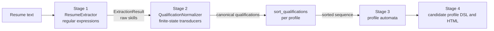

# Module Design: Extraction and Normalization (Stages 1 and 2)

This document describes the modules that implement the first two stages of ResumeLens: **information extraction** with regular expressions and **qualification normalization** with finite-state transducers. It lists every function, its inputs and its outputs. The formal definitions are in [formalization_extraction_normalization.md](formalization_extraction_normalization.md) and the test cases are in [tests_extraction_normalization.md](tests_extraction_normalization.md).

## 1. Position in the pipeline



Stages 1 and 2 do not decide whether a candidate satisfies a profile. Stage 1 only finds text that may be a qualification and Stage 2 only rewrites equivalent spellings into one canonical name.

## 2. Shared data structures

All of them are defined in `src/resumelens/models.py`.

| Structure | Fields | Purpose |
|---|---|---|
| `ExperienceRecord` | `years: int`, `description: str`, `role: str \| None`, `organization: str \| None`, `highlights: list[str]` | One professional experience |
| `ExtractionResult` | `full_name`, `emails`, `phones`, `links`, `location`, `current_role`, `summary`, `education`, `experiences`, `languages`, `frameworks`, `databases`, `tools` | Output of Stage 1 |
| `ProfileCategory` | `name: str`, `qualifications: tuple[str, ...]` | A group of interchangeable qualifications, in priority order |
| `Profile` | `name: str`, `display_name: str`, `categories: tuple[ProfileCategory, ...]` | A professional profile |

The four supported profiles are defined as data in `src/resumelens/profiles.py`. The same code processes all of them.

| Profile | Categories in canonical order |
|---|---|
| `FULL_STACK_DEVELOPER` | `LANGUAGE`, `FRONTEND`, `BACKEND`, `DATABASE`, `VERSION_CONTROL` |
| `MACHINE_LEARNING_ENGINEER` | `LANGUAGE`, `DATA_PROCESSING`, `ML_FRAMEWORK`, `DATABASE`, `VERSION_CONTROL` |
| `DEVOPS_ENGINEER` | `OPERATING_SYSTEM`, `CONTAINER`, `CI_CD`, `CLOUD`, `INFRASTRUCTURE_AS_CODE`, `VERSION_CONTROL` |
| `DATA_ENGINEER` | `LANGUAGE`, `DATABASE`, `DATA_PROCESSING`, `WORKFLOW`, `DATA_WAREHOUSE`, `VERSION_CONTROL` |

`get_profiles() -> list[Profile]` returns the four profiles and `get_profile(name: str) -> Profile` returns one of them or raises `UnknownProfileError`.

## 3. Stage 1: extraction (`src/resumelens/extraction/`)

### 3.1 `patterns.py`

It only contains constants with the regular expressions (strings). Each one is explained in the formalization document.

| Constant | What it recognizes |
|---|---|
| `NAME_PATTERN` | Candidate name (words that start with a capital letter) |
| `EMAIL_PATTERN` | E-mail addresses |
| `PHONE_PATTERN` | Phone numbers, with or without country code |
| `LINK_PATTERN` | Web links and LinkedIn or GitHub profile paths |
| `LOCATION_PATTERN` | A `Location:` line |
| `CURRENT_ROLE_PATTERN` | A `Current role:` or `Role:` line |
| `SUMMARY_PATTERN` | A `Summary:` block up to the next blank line |
| `EDUCATION_PATTERN` | Lines that start with a degree word |
| `EXPERIENCE_HEADER_PATTERN` | `role - organization (N years)` |
| `EXPERIENCE_SENTENCE_PATTERN` | `N years of experience <text>` |
| `HIGHLIGHT_PATTERN` | Bullet lines (`-`, `*`, `•`) |
| `LANGUAGE_PATTERN` | Programming languages and their spellings |
| `FRAMEWORK_PATTERN` | Frameworks and libraries and their spellings |
| `DATABASE_PATTERN` | Databases and their spellings |
| `TOOL_PATTERN` | Tools and technologies and their spellings |

### 3.2 `regex_extractor.py`: class `ResumeExtractor`

| Method | Input | Output | Description |
|---|---|---|---|
| `extract(text)` | `str` | `ExtractionResult` | Normalizes line endings and runs every extraction method. Parent method of the stage |
| `extract_name(text)` | `str` | `str \| None` | Returns the first non-empty line if it fully matches `NAME_PATTERN`, otherwise `None` |
| `extract_contacts(text)` | `str` | `(emails, phones, links)` as three `list[str]` | Extracts contact data without duplicates |
| `extract_education(text)` | `str` | `list[str]` | Returns every line that starts with a degree word |
| `extract_experiences(text)` | `str` | `list[ExperienceRecord]` | Reads experience headers and attaches the bullet lines that follow as `highlights`. If there is no header, it uses `extract_sentence_experiences` |
| `extract_sentence_experiences(text)` | `str` | `list[ExperienceRecord]` | Reads sentences like `3 years of experience developing web applications.` The description defaults to `"professional experience"` |
| `extract_labeled_value(text, pattern)` | `str`, `str` | `str \| None` | First value captured by a labeled line (location, current role) |
| `extract_summary(text)` | `str` | `str \| None` | Summary block with its whitespace collapsed to single spaces |
| `extract_matches(text, pattern)` | `str`, `str` | `list[str]` | Every match of the pattern, in order of appearance, without case-insensitive duplicates and without trailing punctuation |

Behavior details:

- Skills are searched in the **whole text**, not only in the `Technical Skills:` line, so skills mentioned in experience bullets are also found.
- The extracted skill strings are returned **as written** in the resume (for example `JS`, `React.js`, `NodeJS`). Deciding that they are equivalent to other spellings belongs to Stage 2.
- The input is never modified and the method does not raise exceptions for unrecognizable text. It returns an empty `ExtractionResult` instead.
- With a header, `ExperienceRecord.description` is equal to the role.

### 3.3 Accepted resume format

```
Wednesday Addams
Location: Nevermore Academy, Jericho
Current role: Student and independent investigator
Email: wednesday.addams@example.com
Phone: +57 300 123 4567
GitHub: https://github.com/wednesday-addams

Summary:
Detail-oriented developer with three years of experience developing web applications.

Education:
Bachelor in Computer Science - Nevermore Academy

Experience:
Web Application Developer - Nevermore Academy Projects (3 years)
- Developed web applications for organizing investigation notes.
- Implemented backend services using Node.js.

Technical Skills:
JS, React.js, NodeJS, Postgres, Git.
```

The simple format of the assignment (name, `3 years of experience ...` sentence and `Technical Skills:` line) is also accepted.

## 4. Stage 2: normalization (`src/resumelens/normalization/`)

### 4.1 `variants.py`

`QUALIFICATION_VARIANTS: dict[str, list[str]]` maps each canonical qualification (for example `NODE_JS`) to the lowercase spellings that must be rewritten to it (for example `nodejs`, `node.js`, `node js`, `node`). It covers the 41 qualifications used by the four profiles. A spelling belongs to only one canonical name.

### 4.2 `transducer_builder.py`

| Function | Input | Output | Description |
|---|---|---|---|
| `build_transducer(canonical, variants)` | `str`, `list[str]` | `FST` (pyformlang) | Builds a transducer with one path per variant. Every transition reads one character, and the last transition of each path outputs `canonical`. Parent function of the stage |
| `translate_word(transducer, word)` | `FST`, `str` | `str \| None` | Runs the word through the transducer and returns the canonical name, or `None` if no path accepts the whole word |

### 4.3 `normalizer.py`: class `QualificationNormalizer`

| Method | Input | Output | Description |
|---|---|---|---|
| `__init__()` | none | none | Builds `self.transducers: dict[str, FST]`, one per canonical qualification |
| `normalize(raw)` | `str` | `str \| None` | Lowercases the text, collapses spaces, tries the transducers and returns the canonical name or `None` |
| `normalize_all(raw_values)` | `list[str]` | `list[str]` | Normalizes every value, drops unknown skills and duplicates, and keeps the order of first appearance |

### 4.4 `qualification_sorter.py`

| Function | Input | Output | Description |
|---|---|---|---|
| `sort_qualifications(qualifications, profile)` | `list[str]`, `Profile` | `list[str]` | For each category of the profile, in order, keeps only the first qualification (by the priority order of the category) that the candidate has. Categories without a match are skipped and qualifications that do not belong to the profile are discarded |

Sorting removes the dependence on the order in which the candidate wrote the information. The result has at most one qualification per category, in the category order, which is exactly the shape the Stage 3 automata read.

## 5. Worked example

Input (assignment fragment):

```
Wednesday Addams
3 years of experience developing web applications.
Technical Skills:
JS, React.js, NodeJS, Postgres, Git.
```

| Step | Result |
|---|---|
| `extract` | `languages=["JS"]`, `frameworks=["React.js", "NodeJS"]`, `databases=["Postgres"]`, `tools=["Git"]`, `experiences=[ExperienceRecord(3, "developing web applications")]` |
| `normalize_all` (languages + frameworks + databases + tools) | `["JAVASCRIPT", "REACT", "NODE_JS", "POSTGRESQL", "GIT"]` |
| `sort_qualifications` with `FULL_STACK_DEVELOPER` | `["JAVASCRIPT", "REACT", "NODE_JS", "POSTGRESQL", "GIT"]` |

The same candidate written as `Git, NodeJS, JS, Postgres, React.js` produces the same sorted sequence.

## 6. Limitations

- Years of experience are recognized only as digits (`3 years`), not as words (`three years`).
- Location, current role and summary are extracted only when the resume uses their labels.
- Skills are matched by spelling, not by meaning, so a spelling that is not in the catalog is not normalized and is discarded.
- Skill names that are also common words (for example `react` or `spark`) may produce false matches in free text.
